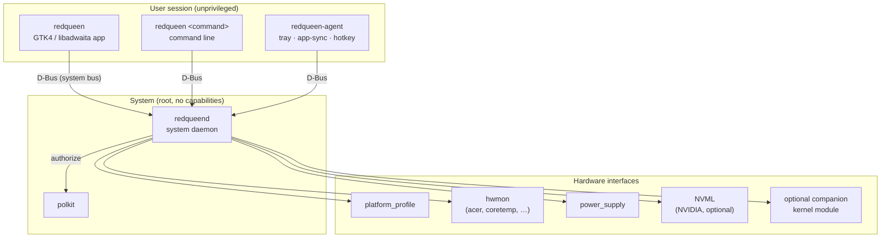

# How The Red Queen Works

The Red Queen is split into small programs with clear jobs. Only one of them
runs with privileges, and it accepts only a fixed list of validated requests.



## Components

| Program | Runs as | Purpose |
|---|---|---|
| `redqueend` | root (empty capability set), systemd service | Owns all hardware access: capability discovery, telemetry, profile and fan control, safety supervisor |
| `redqueen` | the logged-in user | The desktop application, plus the command-line interface (`redqueen status`, `redqueen probe`, …) |
| `redqueen-agent` *(planned)* | the logged-in user, systemd user service | Tray icon, linking applications to profiles, the NitroSense-key shortcut. Keeps working when the window is closed |

The application and command line never touch hardware directly. They talk
to the daemon over D-Bus, so the same rules apply whichever is used.

## Capability discovery

No laptop feature is assumed. At start-up, after resume, and whenever the
kernel reports a hardware change, the daemon looks for each feature and
records a **capability**:

```json
{
  "feature": "thermal_profiles",
  "supported": true,
  "readable": true,
  "writable": true,
  "backend": "platform_profile",
  "reason": null,
  "requires_privilege": true,
  "requires_kernel_module": false,
  "maturity": "detected"
}
```

Devices are found by what they are, never by fixed paths: hwmon devices by
`name` and labels (numbering such as `hwmon7` changes between boots),
batteries by `type=Battery` (not assuming `BAT0`), and the NVIDIA GPU
through NVML (not assuming `card0`).

The interface only shows controls for capabilities that exist. A known
feature that is missing is shown as **"Not available on this hardware"**
together with the reason, never as a switch that does nothing.

### Maturity levels
| Level | Meaning |
|---|---|
| Supported | Tested on real hardware of this model |
| Detected | The interface exists on this machine but hasn't been verified for this model |
| Experimental | Works through reverse-engineered firmware calls; off by default |
| Unsupported | Not available on this hardware, with the reason |
| Unknown | Can't be determined |

## Backends

Each feature has an ordered list of backends. The first one that works is
used; standard kernel interfaces always come first.

| Feature | Backend order |
|---|---|
| Thermal profiles | `platform_profile` → Acer WMI → unavailable |
| Fan speed and control | Acer hwmon → companion module → RPM-only monitoring → unavailable |
| GPU telemetry | NVML → sysfs/hwmon → unavailable |
| Battery | `power_supply` → Acer firmware extension (charge limit, calibration) |
| Keyboard lighting | LED class device → Acer WMI → unavailable |

Backends translate raw values into typed data (for example `ThermalProfileId`
instead of the raw string `"balanced-performance"`), so model-specific names
never leak into the rest of the program.

### Acer Nitro ANV15-51
The kernel's `acer_wmi` driver doesn't yet recognise this model, so thermal
profiles and fan monitoring are only available when the driver's
`predator_v4` option is enabled. The Red Queen can enable it (with
administrator approval) through a single file in `/etc/modprobe.d/`, which
takes effect after a reboot. Fan **control** additionally needs either a newer
kernel or the optional companion module. See the hardware compatibility
notes in the README.

## Every hardware change is verified

Writes are never trusted to have worked:

```
validate request → check authorization → write → read back → compare
      ├─ matches  → update state, notify clients
      └─ differs  → keep the real state, report an error
```

The interface never shows a new value until the daemon has confirmed it.
If the firmware rejects a profile (for example `performance` on a model
without Turbo), that profile is marked unsupported for the session.

## Fan safety

Fan control is treated as safety-critical:

- The default is always the firmware's automatic control.
- Manual mode starts conservatively and is never allowed below a
  configurable minimum. It never writes "0 %", and there is no "fan off"
  option.
- **Return to Auto** is always one click away.
- A safety supervisor in the daemon returns control to the firmware if the
  CPU or GPU temperature passes a critical threshold, if fan readings stop or
  look wrong, or if a hardware write fails.
- Auto is restored before suspend, when the daemon stops, after a crash (a
  persisted flag plus a systemd stop hook), and when the package is removed.
- After resume, hardware is rediscovered from scratch; device paths aren't
  assumed to have survived.
- The kernel's and firmware's own thermal protection stay in charge. The
  Red Queen's safety layer only adds to them.

Fan curves run inside the daemon, not the GUI, with hysteresis so fans
don't speed up and slow down repeatedly around a threshold.

## Telemetry

The daemon samples about once per second (configurable) and keeps the last
60 minutes in an in-memory ring buffer. Clients receive updates only while
they are subscribed, and the interface redraws only when values change.
Nothing is written to disk per sample, and telemetry values aren't logged.

On machines with switchable graphics, reading NVIDIA telemetry wakes a
sleeping GPU and costs battery. The daemon checks the GPU's power state first
and shows "GPU sleeping" instead of waking it. It also drops implausible
readings, such as the first power sample right after the GPU wakes.

## Profiles and app-sync

Scenario profiles (thermal profile, fan mode and curves, lighting, battery
behaviour, linked applications) are TOML files in
`~/.config/red-queen/profiles/`. The user agent watches for linked
applications starting and stopping and switches profiles with debounce and a
clear priority:

```
explicit user choice > running linked application > AC/battery rule > default
```

## Files and locations

| Path | Contents |
|---|---|
| `~/.config/red-queen/` | User settings and scenario profiles |
| `/etc/red-queen/` | System-wide configuration (safety thresholds, minimum fan speed) |
| `/var/lib/red-queen/` | Daemon state (for example "manual fan control active", used for crash recovery) |

## Source layout

| Crate | Role |
|---|---|
| `rq-core` | Domain types, capability model, fan-curve and hysteresis logic (no I/O) |
| `rq-hardware` | Backends: platform_profile, hwmon, power_supply, NVML, Acer WMI |
| `rq-ipc` | D-Bus interface definitions shared by the daemon and clients |
| `rq-config` *(planned)* | Settings and profile files, schema versions, migrations |
| `redqueend` | The system daemon |
| `redqueen` | The desktop application and command line |
| `redqueen-agent` *(planned)* | The user-session agent |
| `rq-testkit` | Fake sysfs trees and mocks for tests |
